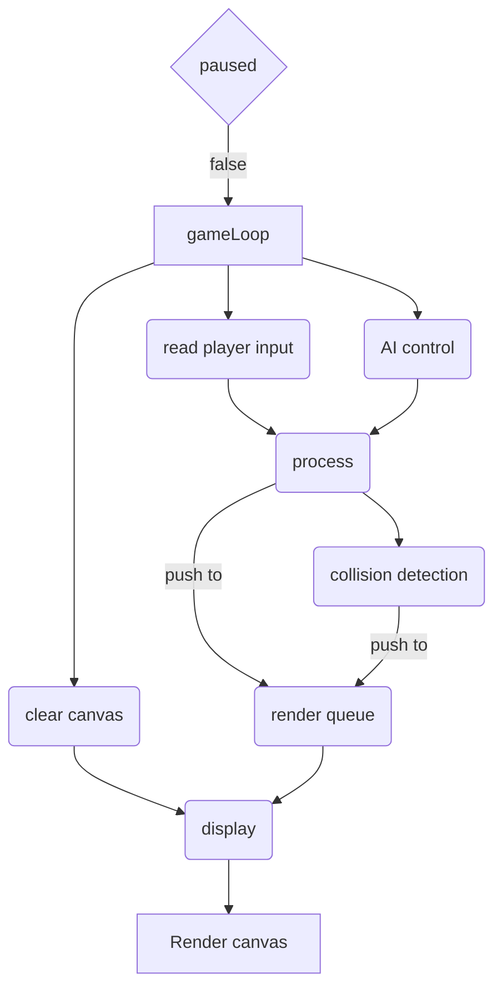

# Project space invaders

[Play it here ](https://snipspin.github.io/space-invaders/)
---

## Basic game idea and project definition
This game is inspired by space invaders and Galaga and is implemented with the following technologies:

- HTML
- CSS
- JavaScript

It is made in basic HTML and CSS for the layout on a single page, a canvas for the game presentation and plain JavaScript for the logic.
    
### MVP
 
- The application consists of a single HTML file which has a button to start a new game, or pause the current one.
    - The player side:
        - Show a rectangle that represents the player
        - Move the player rectangle according to keyboard inputs
        - Launch a projectile to attack the enemy
        - Die if hit by an enemy projectile and hit points get below 1

    - The enemy side:
        - Show one or more rectangles to represent the enemy side in the top 2 thirds of the game screen
        - Move the enemy rectangles horizontally 
        - Occasionally attack the player with projectiles
        - Die if hit by a player projectile and hit points get below 1

- If the player died, end the current game and show a game over message
- If all enemies died, end the current game and show a board cleared message
- Ask if the player wants to play again

### Stretch goals
- Show an explosion for destroyed enemies or the player
- Have multiple levels for the player to go through 
- Increase difficulty with each level by introducing more frequent attacks
- Increase difficulty with each level by making the enemy move towards the player
- Enemies may move horizontally to avoid getting hit
- Have different types of enemies who have more hit points and different colors
- Player can collect different weapon types that enemies drop after death
- Player can collect different disadvantages that enemies drop after death 
e.g. slower movement

### Wireframe


---


## Planning

In the beginning the focus was on the basic game logic, which means how and in which order will the game logic be executed

Since the user interacts with the game mostly through the keyboard to manipulate the canvas, it appears reasonable to use some kind of basic game loop.
The player themself needs some kind of representation as does the enemy.
Another important role has the drawing on canvas which is used to represent the graphical state of the game.

### Basic needs

There are four separate parts who form the game as a whole.
Those are
- read and process user input
- represent the user
- represent the enemy
- manipulate the canvas

In an active game the game loop ensures that those parts come in to play until the game itself is over or its state changed to paused.

## Implementation

Through the use of a timer the game loop will be executed in a fixed interval.
That ensures the ability of the player and enemy to take action or react to the opponents actions.
Both the player and the enemy are represented by an object that represents them and delegates the manipulation of state.


It has been useful to break the goals/milestones for a MVP down into user stories like the following:
### Milestones

#### MVP
- [x] A user sees a rectangle on a screen
- [x] The rectangle can be horizontally moved with the keys A + D
- [x] By pressing the key W the user can shoot (a narrow yellow rectangle)
- [x] Enemy rectangles appear in the top half of the game screen
- [x] The user can destroy an enemy by shooting at it
- [x] The enemy shoots at the user and can damage them
- [x] There are multiple enemies
- [x] Enemies move horizontally to feel more alive
- [x] Show a game over message if the player died
- [x] Show a board cleared messge if all enemies died
- [x] Ask the user if they want to play another round

This way of development helped because it allows to change the architecture throughout the project and apply a different style if needed instead of planning to far ahead.
From there the codebase evolved naturally through defined goals.

### Basic flowchart of the game loop


---

## How is it actually made and how does it work

A user who plays the game is represented by a blue rectangle on the bottom of the game screen.
That rectangle can be moved horizontally through the keys A and D or ← and →.

Above the user's rectangle are one or more red colored rectangles who represent the enemy.
The enemy also moves horizontally and sometimes they even shoot a yellow projectile downward into the user's third of the screen.

By pressing the keys W or ↑ the blue rectangle will also shoot yellow projetile upward the screen.

If the user destroyes all enemies, they will be asked to play again or move on to the next level.

In case the enemy wins, the game is over and the user would have to start from the beginning.

### What technologies are used

The whole game is made in HTML with a canvas and CSS for the frontend plus JavaScript for the logic, manipulation of the DOM and canvas manipulation.

### Bugs or obstacles throughout the process

One nice thing about doing all that work by hand is the appreciation for frameworks that make it easier to deal with certain problems that occur in many games.

Collision detection may be one of those. 
In this particular game the detection for collisions is simplified and not pixel perfect.

The canvas is logically separated in rows and columns to make it easier to find objects that are in range for a collision.
That cell size is exactly the size of on rectangle who represent space ships which means that a space ship can be in 4 cells at the same time.

It also allows to determine if a projectile is in range of any space ship and eliminates the need to check every single space ship against collision with every single projectile.

Another thing that caused confusion are timers.
If the user pauses the game and then starts a new one, or pauses and replays the level the game is faster than it should be.
It took some time to find a suitable solution to maintain a good experience while playing the game.

---

## Implemented stretch goals

For a better game experience some kind of explosion visualisation is implemented.
It is an animation which draws outgrowing and circular ordered lines from the origin of a destroyed space ship.


In order to make it more interesting the amount of enemy ships grows with each level until the user reaches level 14.
With level 14 the enemy starts to shoot more frequently and increases the challenging aspect of the game.


## Code examples

### How user input is handled

In order to avoid big blocks of conditions the object which is manipulated by the users input stores relevant keys in a key value pair.
Each key stores which method is related to a particular key pressed by the user.

```javascript=
function SpaceShip() {
    this.moveLeft = () => {
        // move the space ship to the left
    },
    this.moveRight = () => {
        // move the space ship to the right
    },
    this.shoot = () => {
        // launch a projectile
    },
    this.keyMap = {
        "65": this.moveLeft,
        "68": this.moveRight,
        "87": this.shoot,
        "37": this.moveLeft,
        "39": this.moveRight,
        "38": this.shoot
    },
    this.inputHandler = function(inputLetter) {
        // call the requested method stored in this.keyMap
    }
};
```

To access those methods and respond to the users input the input handler loops through a set of space ships and calls the value.
```javascript=
for (const item of spaceShips) {
    // check if the key actually exists and if it does, call the value which is a function
    if (item[1].keyMap.hasOwnProperty(inputLetter)) {
        item[1].keyMap[inputLetter].call();
    }
}
```

### How rendering is handled

As the user plays the game the amount of enemy space ships grows to a maximum of 91.
Together with the players space ship and the possible projectiles in the game the amount of objects to render grows quickly.
Since it's crucial to render a graphical representation the process of rendering uses the observer pattern to stay open for extensions.

A map is used to store objects that want to be called when the next render process happens.
Map comes with useful built in features to add, remove, empty or count and more to interact with it.
```javascript=
let renderSubscribers = new Map();
```

Objects who create other objects that need to be rendered now have the ability to simply add those to the list of render subscribers.

```javascript=
function ShipHandler() {
    this.renderKey = 'space-ship',
    this.addToRenderSubscribers = (spaceShip) => {
        spaceShip.renderKey = `space-ship${renderSubscribers.size}`;
        renderSubscribers.set(spaceShip.renderKey ,spaceShip);
    },
    this.removeFromRenderSubscribers = (spaceShip) => {
        renderSubscribers.delete(spaceShip.renderKey, spaceShip);
    }
};
```

During the render process that map will simply be looped through and calls the render method, which has to be implemented, of each stored object.

```javascript=
function Display() {
    this.render = () => {
        // loop through the map of renderSubscribers
        for (const item of renderSubscribers) {
            // and call their own render method
            item[1].render(this.context);
        }
    }
};
```

SpaceShip is one of the objects who want to be rendered and simply needs to implement the render method.

```javascript=
function SpaceShip() {
    this.render = (context) => {
        context.fillStyle = this.color;
        context.fillRect(this.x, this.y, this.width, this.height);
    }
}
```


## Resources and recommendations

w3schools.com offers a lot of material to interesting topics.
[https://www.w3schools.com HTML5 canvas](https://www.w3schools.com/html/html5_canvas.asp)
In this case it helped to get a basic understanding of how to use a canvas in HTML5.

[stackoverflow - detect if multiple keys are pressed](https://stackoverflow.com/questions/5203407/how-to-detect-if-multiple-keys-are-pressed-at-once-using-javascript)
While playing it didn't feel good to just be able to one thing at a time, either move or shoot.
The game experience improved with the ability to process multiple inputs and the implementation into the then current way of processing user input was pretty straight forward.

Last but not least...
[MDN — the Mozilla Developer Network](https://developer.mozilla.org/en-US/)
[Canvas API](https://developer.mozilla.org/en-US/docs/Web/API/Canvas_API)
[JavaScript](https://developer.mozilla.org/en-US/docs/Web/JavaScript)